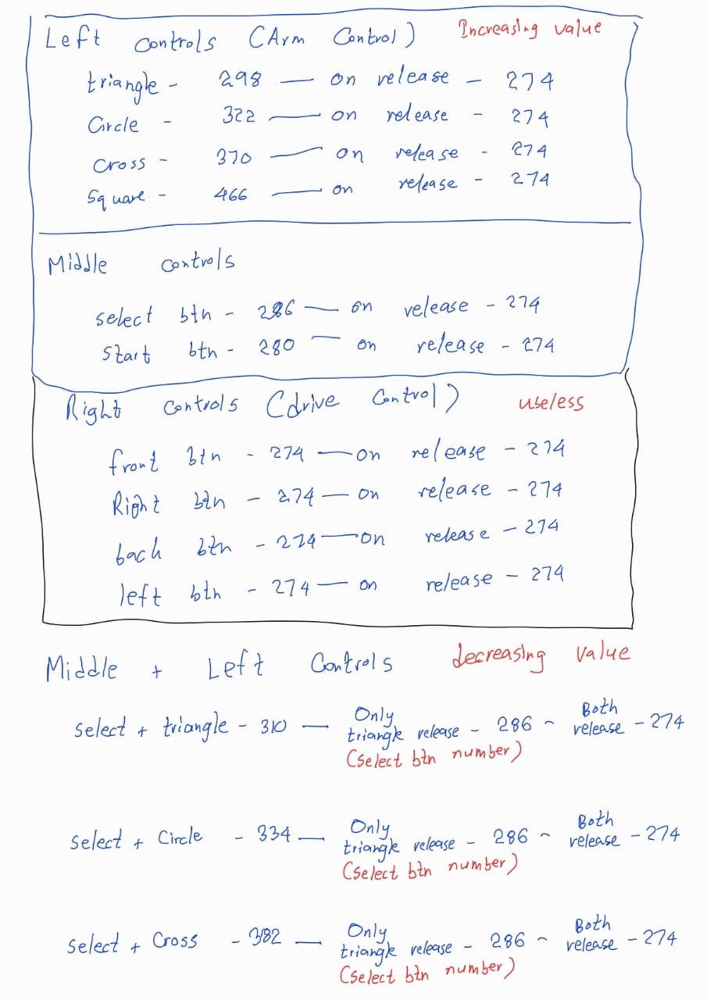
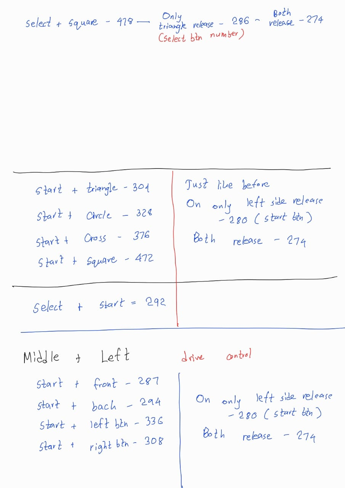

# Robot Car with Ackermann + Differential Steering and 4-DoF Arm

Educational robotics project did for teaching electronics and robotics fundamentals for group of students.

## Overview

This project combines:
- **Ackermann steering** + **Differential drive** for vehicle control
- **4-DoF robotic arm** for manipulation tasks
- **Dabble app** (Bluetooth gamepad) for wireless control

## Controller Setup

### Dabble App Bluetooth Integration

The project uses the Dabble app as a Bluetooth gamepad controller. Due to command parsing issues with the default library, the following patches were needed to make it functional.

### Required Patches

#### 1. Modify `DabbleESP32.cpp`

Replace the `processInput()` function with:
```cpp
int DabbleClass::processInput()
{
    if(esp32ble.available())
    {
        isDabbleConnected = true;

        int sum = 0;
        int i = 0;
        while(esp32ble.available())
        {
            i += 1;

            byte data = esp32ble.read();

            processInput(data);
            sum += (uint8_t)data * i;
        }
        return sum;
    }
    return 0;
}
```

#### 2. Update `DabbleESP32.h`

Change the function signature from `void` to `int`:
```cpp
int processInput();
```

## Control Mapping





## Hardware Components

- ESP32 microcontroller
- Motor drivers for differential/Ackermann steering
- Servo motors for 4-DoF arm
- Bluetooth module (integrated in ESP32)

## Usage

1. Install the Dabble app on your mobile device
2. Apply the library patches as described above
3. Upload the code to your ESP32
4. Connect via Bluetooth using the Dabble app
5. Use the gamepad controls to operate the robot

---

*Educational project for robotics coursework*